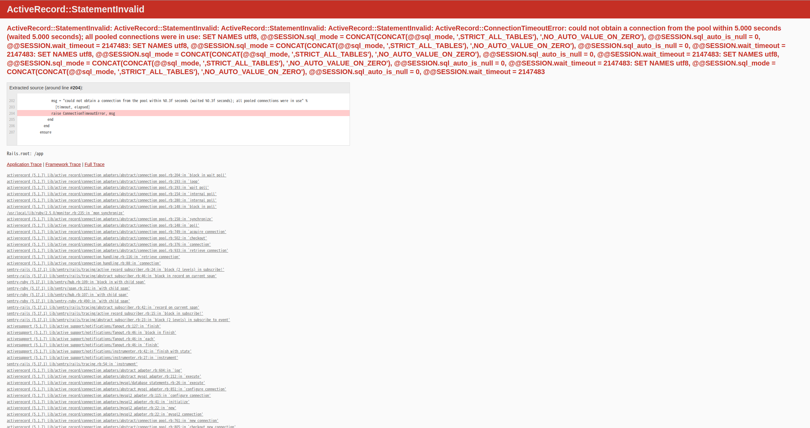

# README for Reproducible Example Project

This README guides you through setting up the project, including Sentry integration, building the Docker environment, and accessing the application.

## Setup Sentry

1. **Configure Sentry DSN:**
   - Update your Sentry DSN in the `app/config/sentry.rb` file to ensure proper error tracking.

## Build and Run the Application

2. **Build and Start the Application with Docker:**
   - Use the following commands to build and start your Dockerized application:

     ```bash
     docker-compose build
     docker-compose run --rm app bundle install
     docker-compose run --rm app bundle exec rake db:create
     docker-compose run --rm app bundle exec rake db:migrate
     docker-compose up
     ```

## Accessing the Application

3. **View the Application:**
   - Open a web browser and go to `localhost:3000/posts` to view the application.

## Error Representation

- Below is an example of an error you might encounter:

  

## PR
PR: https://github.com/getsentry/sentry-ruby/pull/2278

To ensure this issue is fixed, please replace the relevant line in your Gemfile with the following:
```ruby
gem 'sentry-rails',  git: 'https://github.com/Iwaide/sentry-ruby.git', branch: 'iwaide/fix-activerecord-subscriber'
```
